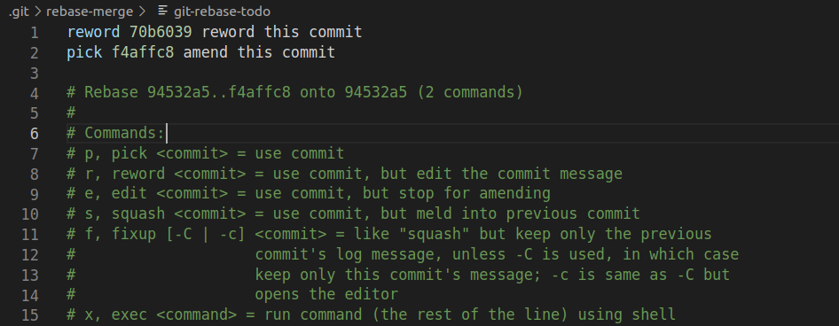
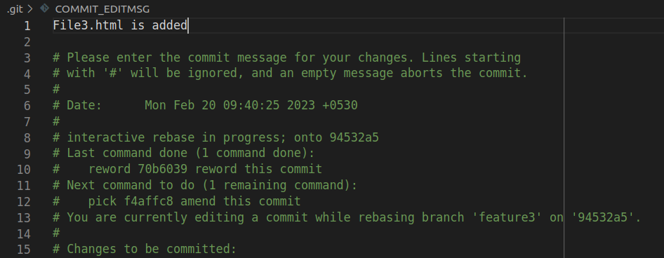
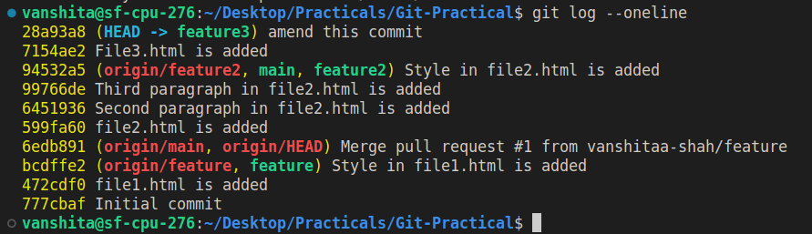
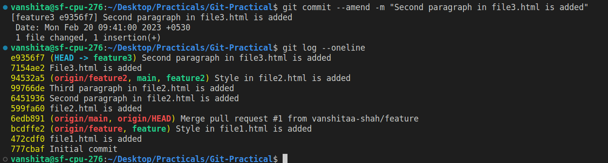
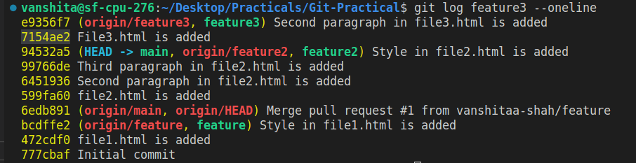
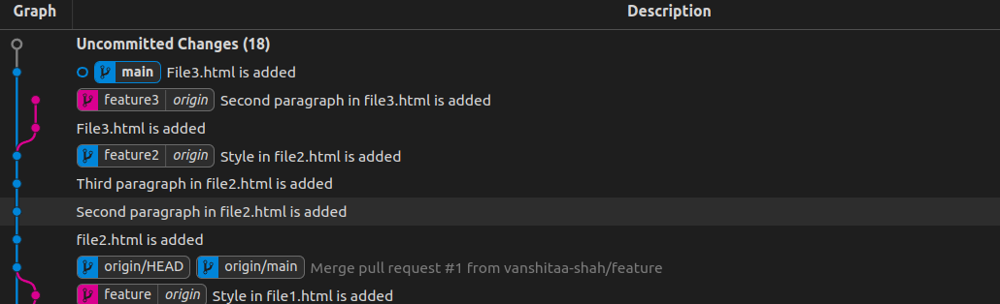
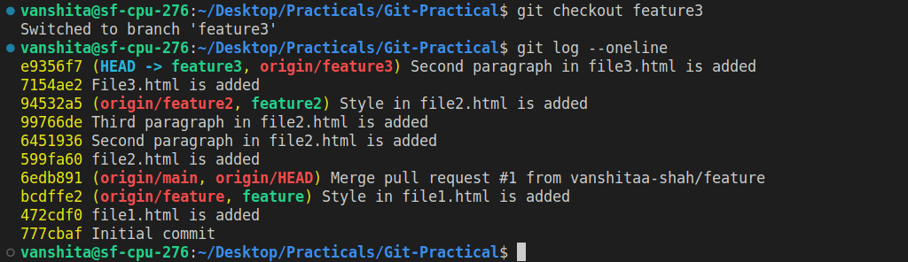
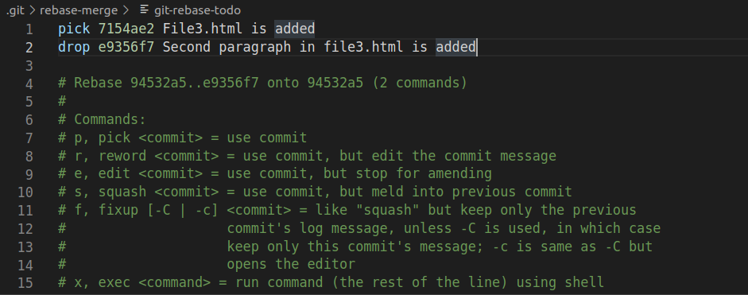
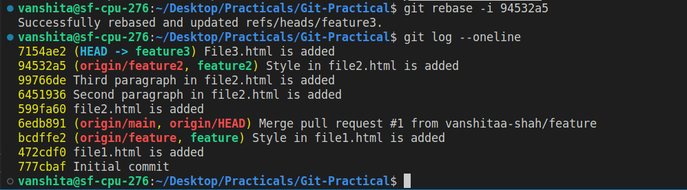

# Git-Practical
## The feature3 branch is created for task-3,4,5 of Git praticals.
### 3.Change commit message

Commit push on commit in feature branch and then change commit

- To change last commit's message we can use `--amend` option in `git commit` and provide a new message with -m option. Amend operation is used to append changes to last Commit instead of creating a new commit.
- For changing commit messages of random commits, interactive rebasing `git rebase -i` is used.Hash code of any previous commits can be given, history from head to that commit will be visible. Use `Reword` option for those commits you would like to change messages of.
- Now for pushing changes in remote , -f (forcefully) option is used to forcefully make changes in remote repo.We can not push directly because commits of remote are not in sync with local.

  - Step-1 : Created new branch feature3 and new file3.html.
  - Step-2 : Made some changes and commited them.

  ```bash
      git checkout -b feature3
      #Made some changes add added temporary message.
      git add file3.html
      git commit  -m "reword this commit"
      #Made more changes and again added temp message.
      git add file3.html
      git commit  -m "amend this commit"
      #pushed feature3 barnch to remote
      git push -u feature3
  ```

  **Log Before**

  

  - Step-3 : For changing random commit messages use interactive rebasing.

  ```bash
      git rebase -i 94532a5 #here hash of any previous commit should be given
  ```

  - Step-4 : Editor will open replace pick option with reword for the commits you want to change the messages of.

  

  - Step-5 : Now again in editor change the commit message.

  

  **Log After reword**

  

  **Using Amend**

  - Step-1 : use amend with commit command to change message of latest commit.

  **Log before amend**

  

  ```bash
      git commit --amend -m "Second paragraph in file3.html is added"
  ```

  **Log after amend**

  

  - Final step : pushed feature3 forcefully to remote.

  ```bash
      git push -f origin feature3
      #-f used for forcefully pushing feature3
  ```

### 4. cherry pick

Pick some commits from feature branch to master branch

- Cherry-pick is used to take some selected commits from any branch and apply them with current branch without merging whole branch.
- Hash codes of commits can be used to directly select commits we want to merge.

  - Step-1 : Now we have two commits in feature3 branch, we will copy one commit from feature3 to main by using cherry-pick.

  ```bash
      git checkout main #switched to main branch
      git cherry-pick 7154ae2 #hash of the commit we want to cherry pick
  ```

  **Log of main branch before cherry pick**

  

  **Log of feature3 branch**

  

  **Log of main branch after cherry pick**

  

  **Final workflow**

  

### 5. Drop commit

Remove some commit from feature branch.

- For dropping randomly selected commits, interactive rebasing `git rebase -i` is used. Use `drop` option for commits we want to drop.
- Hash code of any previous commits can be given, history from head to that commit will be visible.
- Reset can also drop commits but in sequence of HEAD~n.Revert can undo the commit but does't drop them.

  - Step-1 : For dropping random commits we use interactive rebasing with drop option.

  - Step-2 : Go to feature3 branch check log.

  

  - Step-3 : Copy hash of the commits you would like to drop.

  ```bash
      git rebase -i 94532a5 #here hash of any previous commit should be given
      #or
      git rebase -i HEAD~n
  ```

  - Step-4 : Editor will be open replace pick with drop for the commits you want to drop.

  

  **Log After Drop**

  
