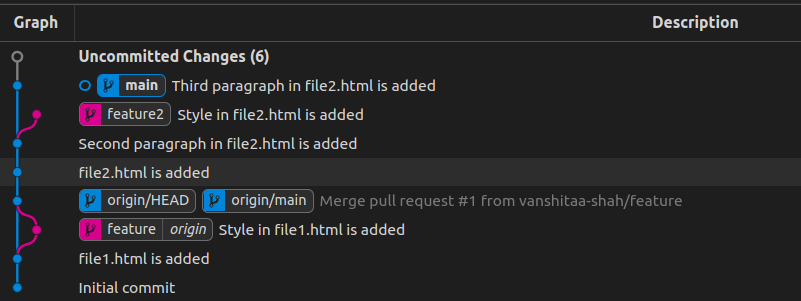
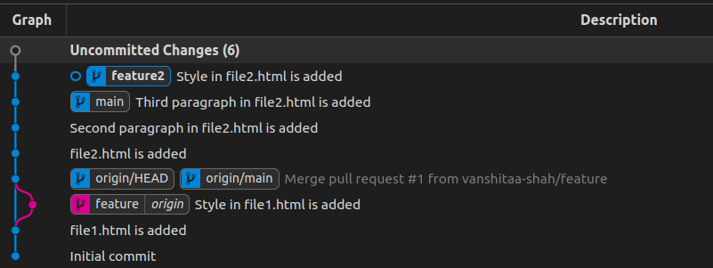
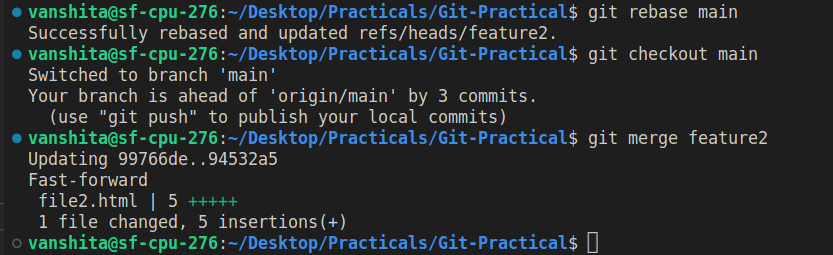

# Git-Practical Task-2
## The feature2 branch is created for task-2 of git practical. 
### 2. Rebase

Try to rebase feature branch with main branch

- Rebase operation is used to change the base of our current branch. It moves commits of feature(current) branch on head(latest commit) of specified branch.
- It makes commit history linear,so fast forward merge can happen.
- Options like --continue , --skip can be used in order to continue or skip the changes while rebasing.

  - Step-1 : Created file2.html in main branch locally.
  - Step-2 : Add and commit.

  ```bash
     git add file2.html
     git commit -m "file2.html is added"
  ```

  - Step-3 : Made some changes in file2.Again, added and commited them.

  ```bash
     git add file2.html
     git commit -m "Second paragraph in file2.html is added"
  ```

  - Step-4 : Created another branch feature2 and switched to that.

  ```bash
     git checkout -b feature2
  ```

  - Step-5 : Made some changes in file2 added and commited them.

  ```bash
      git add file2.html
      git commit -m "Style in file2.html is added"
  ```

  - Step-6 : Switched to main branch.Made some changes in file2.Again added and commited.

  ```bash
      git checkout main
      git add file2.html
      git commit -m "Third paragraph in file2.html is added"
  ```

  **Workflow till now**

  

  - Step-7 : Switched to feature2 branch, changed its base to latest commit of main using rebase command

  ```bash
      git checkout feature2
      git rebase main
      # we can also use -i for interactive rebasing to do rebase in more flexible way.
  ```

  **Workflow after rebasing**

  

  - Step-8 : Now our history is linear, we can merge feature2 in main by fast forward merge.

  ```bash
      git checkout main
      git merge feature2
      # Fast forward merge.
  ```

  
