# Git-Practical

### 1. Pull and Merge difference

Make example of pull request and two branch merge event.

- Pull requests are short messages with a description of changes made to a branch. By sending a pull request or merge request, you are asking the receiver of the request to review those changes prior to merging them into another branch.
- As we don't make changes on main branch directly. A developer or collaborator always develop on another branch. Once the development is completed, a pull request is created to merge into master branch.If you don't want the changes of feature branch to be merged to the upstream branch, you can close the pull request without merging.
- A merge conflict is a scenario where Git is not able to automatically merge changes as it gets confused between two different versions of code for the same file, Manually resolve the conflict by editing the file keeping the content we want.

  - Step-1 : Created one file named file1.html in main branch locally.
  - Step-2 : added and commited file1.html.
    ```bash
    git add file1.html
    git commit -m "file1.html is added"
    ```
  - Step-3 : pushed main branch in remote repository, also set upstream by using -u.
    ```bash
    git push -u origin main
    ```
  - Step-4 : Created another branch named feature and switched to that branch.
    ```bash
    git branch feature
    git checkout feature
    #or in single command
    git checkout -b feature
    ```
  - Step-5 :Some changes in file1.html added and commited locally and also pushed them to remote repo.
    ```bash
    git add file1.html
    git commit -m "Style in file1.html is added"
    git push  -u origin feature
    ```
  - Step-6 : Now in github go to feature branch , select compare and pull request option.

    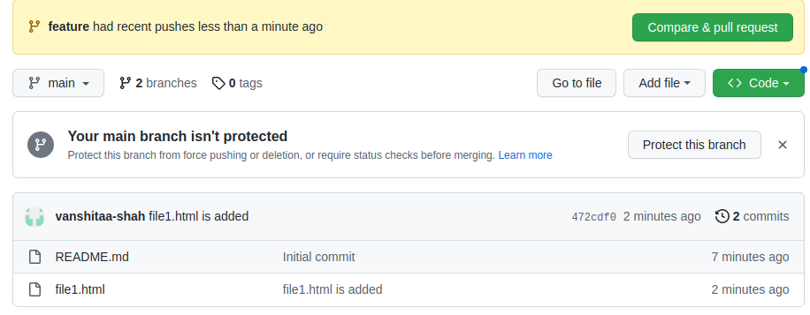

  - Step-7 : Generate a pull request by adding appropriate title and comment.

    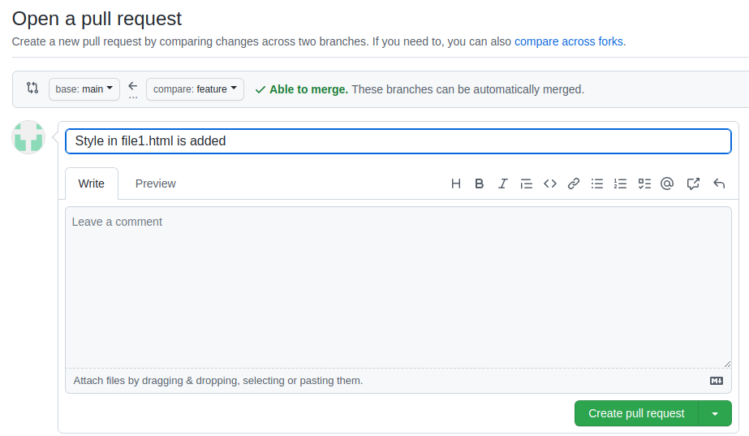

  - Step-8 : Now owner or higher authority of repo will get a PR ,they go to PR section review changes. If changes are valid then merge them.

    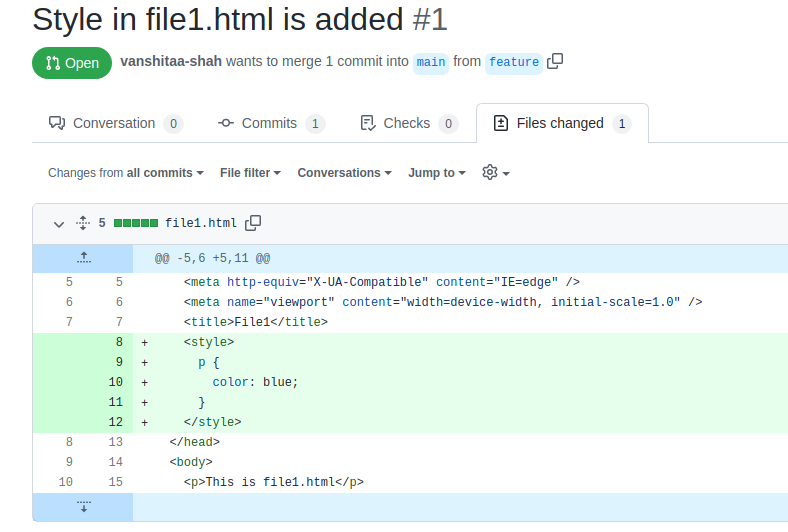

    

    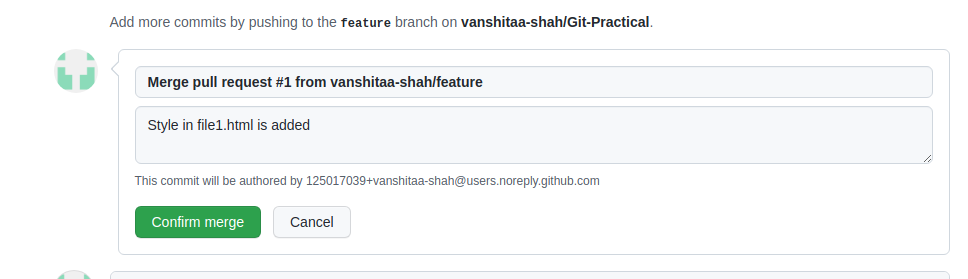

  - Step-9 : Now if you want you can delete feature branch.

  - Step-10 : Pull the changes in local, so now remote and local branch are up-to-date.
    `bash
        git checkout main
        git pull origin main 
        #or simply git pull will work because upstream is already set.
    `
    **Workflow**

  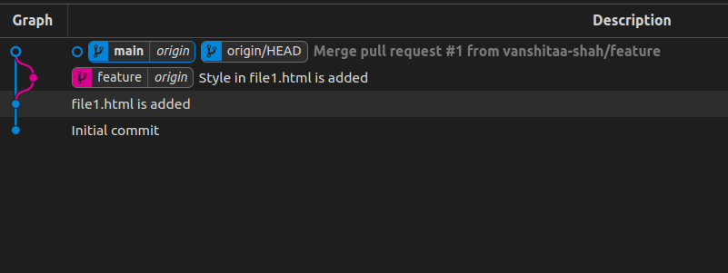

### 2. Rebase

Try to rebase feature branch with main branch

- Rebase operation is used to change the base of our current branch. It moves commits of feature(current) branch on head(latest commit) of specified branch.
- It makes commit history linear,so fast forward merge can happen.
- Options like --continue , --skip can be used in order to continue or skip the changes while rebasing.

  - Step-1 : Created file2.html in main branch locally.
  - Step-2 : Add and commit.

  ```bash
     git add file2.html
     git commit -m "file2.html is added"
  ```

  - Step-3 : Made some changes in file2.Again, added and commited them.

  ```bash
     git add file2.html
     git commit -m "Second paragraph in file2.html is added"
  ```

  - Step-4 : Created another branch feature2 and switched to that.

  ```bash
     git checkout -b feature2
  ```

  - Step-5 : Made some changes in file2 added and commited them.

  ```bash
      git add file2.html
      git commit -m "Style in file2.html is added"
  ```

  - Step-6 : Switched to main branch.Made some changes in file2.Again added and commited.

  ```bash
      git checkout main
      git add file2.html
      git commit -m "Third paragraph in file2.html is added"
  ```

  **Workflow till now**

  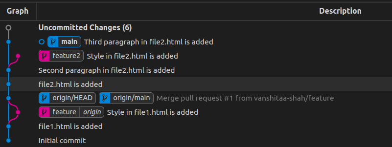

  - Step-7 : Switched to feature2 branch, changed its base to latest commit of main using rebase command

  ```bash
      git checkout feature2
      git rebase main
      # we can also use -i for interactive rebasing to do rebase in more flexible way.
  ```

  **Workflow after rebasing**

  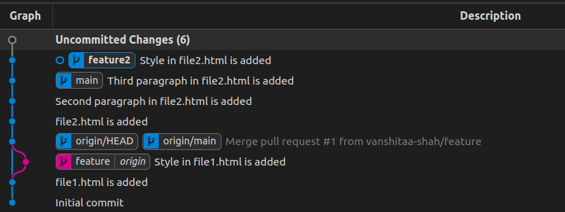

  - Step-8 : Now our history is linear, we can merge feature2 in main by fast forward merge.

  ```bash
      git checkout main
      git merge feature2
      # Fast forward merge.
  ```

  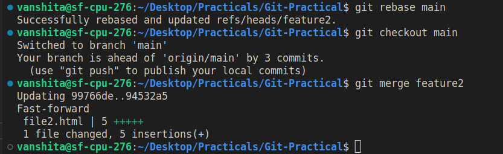

### 3.Change commit message

Commit push on commit in feature branch and then change commit

- To change last commit's message we can use `--amend` option in `git commit` and provide a new message with -m option. Amend operation is used to append changes to last Commit instead of creating a new commit.
- For changing commit messages of random commits, interactive rebasing `git rebase -i` is used.Hash code of any previous commits can be given, history from head to that commit will be visible. Use `Reword` option for those commits you would like to change messages of.
- Now for pushing changes in remote , -f (forcefully) option is used to forcefully make changes in remote repo.We can not push directly because commits of remote are not in sync with local.

  - Step-1 : Created new branch feature3 and new file3.html.
  - Step-2 : Made some changes and commited them.

  ```bash
      git checkout -b feature3
      #Made some changes add added temporary message.
      git add file3.html
      git commit  -m "reword this commit"
      #Made more changes and again added temp message.
      git add file3.html
      git commit  -m "amend this commit"
      #pushed feature3 barnch to remote
      git push -u feature3
  ```

  **Log Before**

  

  - Step-3 : For changing random commit messages use interactive rebasing.

  ```bash
      git rebase -i 94532a5 #here hash of any previous commit should be given
  ```

  - Step-4 : Editor will open replace pick option with reword for the commits you want to change the messages of.

  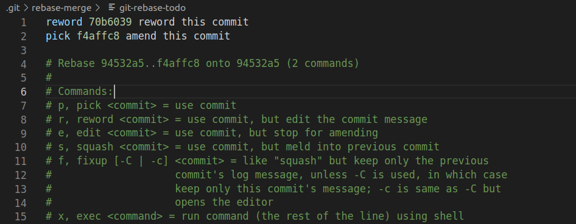

  - Step-5 : Now again in editor change the commit message.

  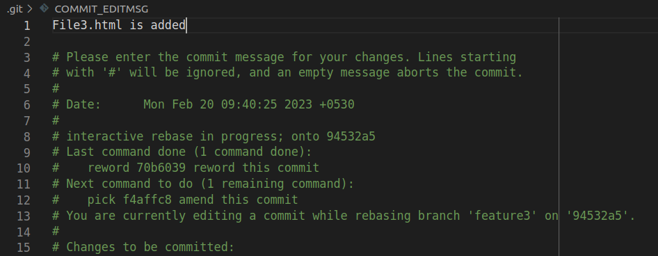

  **Log After reword**

  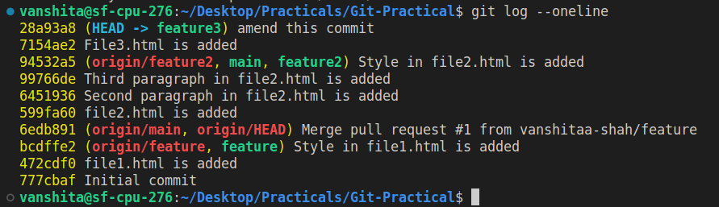

  **Using Amend**

  - Step-1 : use amend with commit command to change message of latest commit.

  **Log before amend**

  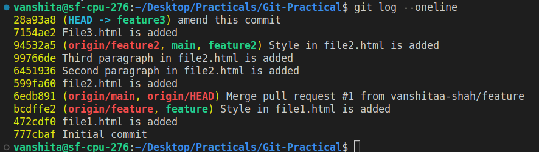

  ```bash
      git commit --amend -m "Second paragraph in file3.html is added"
  ```

  **Log after amend**

  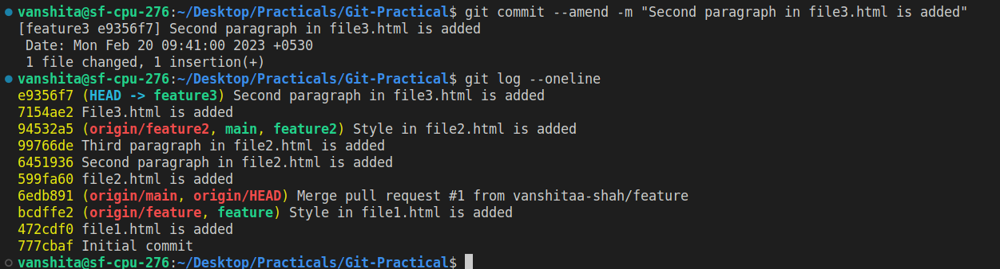

  - Final step : pushed feature3 forcefully to remote.

  ```bash
      git push -f origin feature3
      #-f used for forcefully pushing feature3
  ```

### 4. cherry pick

Pick some commits from feature branch to master branch

- Cherry-pick is used to take some selected commits from any branch and apply them with current branch without merging whole branch.
- Hash codes of commits can be used to directly select commits we want to merge.

  - Step-1 : Now we have two commits in feature3 branch, we will copy one commit from feature3 to main by using cherry-pick.

  ```bash
      git checkout main #switched to main branch
      git cherry-pick 7154ae2 #hash of the commit we want to cherry pick
  ```

  **Log of main branch before cherry pick**

  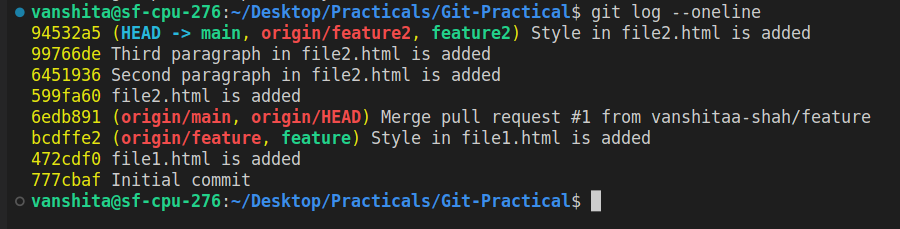

  **Log of feature3 branch**

  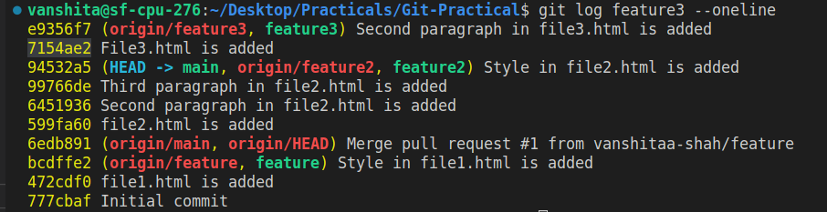

  **Log of main branch after cherry pick**

  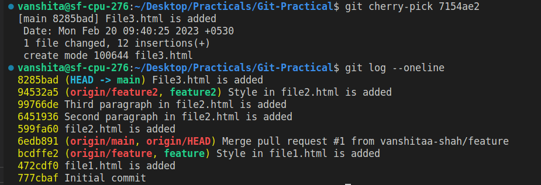

  **Final workflow**

  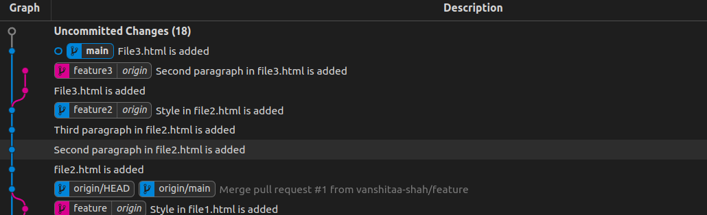

### 5. Drop commit

Remove some commit from feature branch.

- For dropping randomly selected commits, interactive rebasing `git rebase -i` is used. Use `drop` option for commits we want to drop.
- Hash code of any previous commits can be given, history from head to that commit will be visible.
- Reset can also drop commits but in sequence of HEAD~n.Revert can undo the commit but does't drop them.

  - Step-1 : For dropping random commits we use interactive rebasing with drop option.

  - Step-2 : Go to feature3 branch check log.

  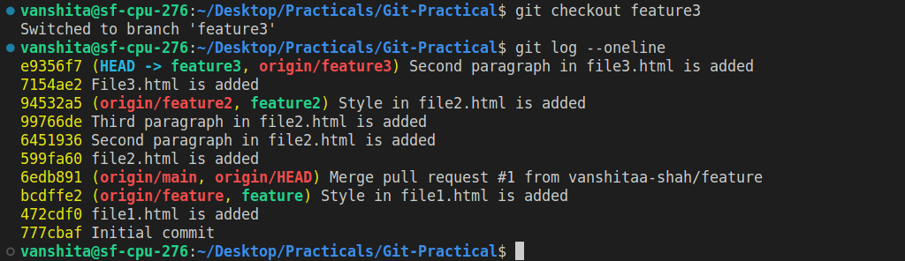

  - Step-3 : Copy hash of the commits you would like to drop.

  ```bash
      git rebase -i 94532a5 #here hash of any previous commit should be given
      #or
      git rebase -i HEAD~n
  ```

  - Step-4 : Editor will be open replace pick with drop for the commits you want to drop.

  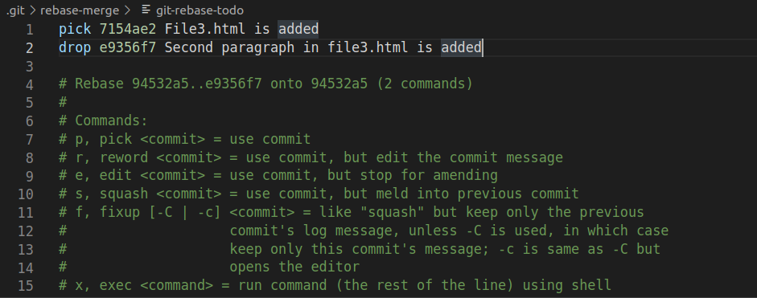

  **Log After Drop**

  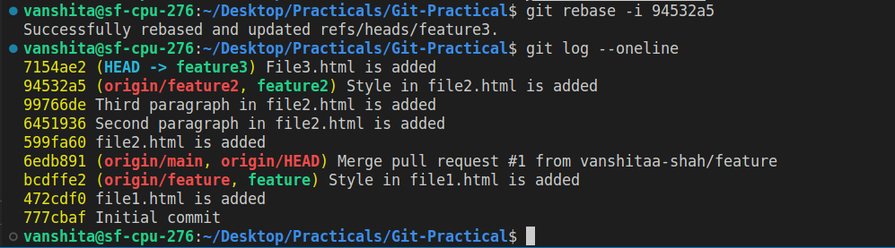
