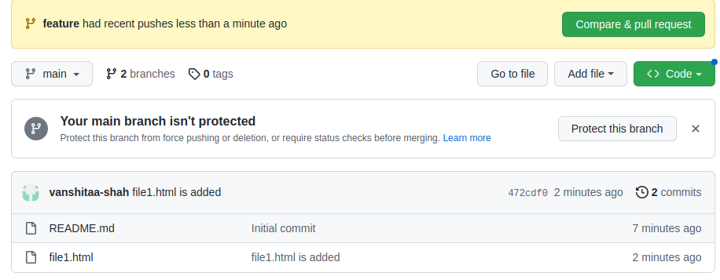
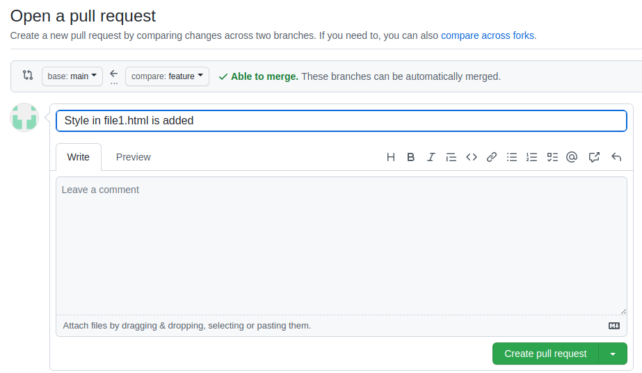
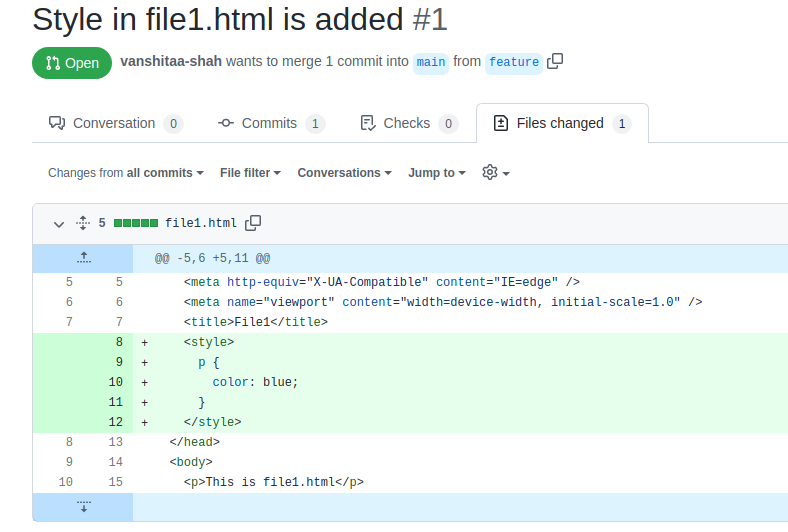
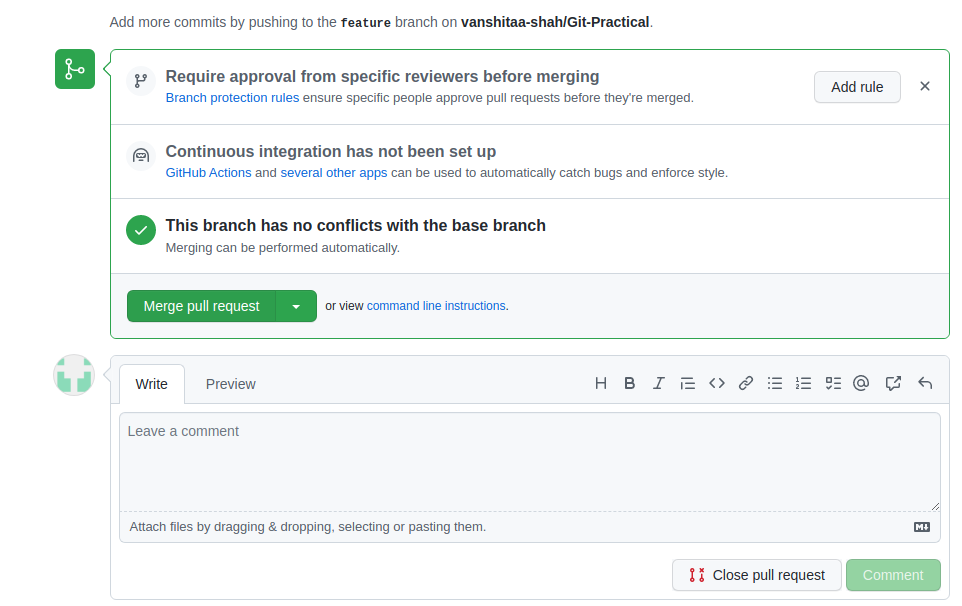
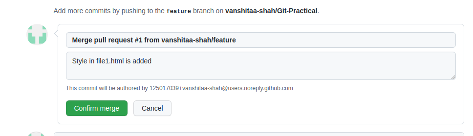
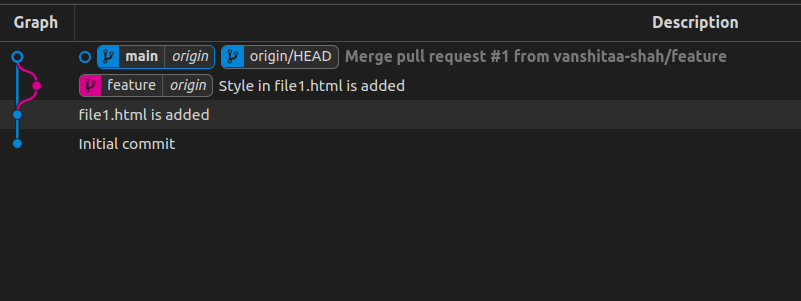

# Git-Practical Task-1
## The feature branch is created for task-1 of git practical.

### 1. Pull and Merge difference

Make example of pull request and two branch merge event.

- Pull requests are short messages with a description of changes made to a branch. By sending a pull request or merge request, you are asking the receiver of the request to review those changes prior to merging them into another branch.
- As we don't make changes on main branch directly. A developer or collaborator always develop on another branch. Once the development is completed, a pull request is created to merge into master branch.If you don't want the changes of feature branch to be merged to the upstream branch, you can close the pull request without merging.
- A merge conflict is a scenario where Git is not able to automatically merge changes as it gets confused between two different versions of code for the same file, Manually resolve the conflict by editing the file keeping the content we want.

  - Step-1 : Created one file named file1.html in main branch locally.
  - Step-2 : added and commited file1.html.
    ```bash
    git add file1.html
    git commit -m "file1.html is added"
    ```
  - Step-3 : pushed main branch in remote repository, also set upstream by using -u.
    ```bash
    git push -u origin main
    ```
  - Step-4 : Created another branch named feature and switched to that branch.
    ```bash
    git branch feature
    git checkout feature
    #or in single command
    git checkout -b feature
    ```
  - Step-5 :Some changes in file1.html added and commited locally and also pushed them to remote repo.
    ```bash
    git add file1.html
    git commit -m "Style in file1.html is added"
    git push  -u origin feature
    ```
  - Step-6 : Now in github go to feature branch , select compare and pull request option.

    

  - Step-7 : Generate a pull request by adding appropriate title and comment.

    

  - Step-8 : Now owner or higher authority of repo will get a PR ,they go to PR section review changes. If changes are valid then merge them.

    


   


   

  - Step-9 : Now if you want you can delete feature branch.

  - Step-10 : Pull the changes in local, so now remote and local branch are up-to-date.
  
    ```bash
        git checkout main   
        git pull origin main   #or simply git pull will work because upstream is already set.
    ```
    
    **Workflow**

  
